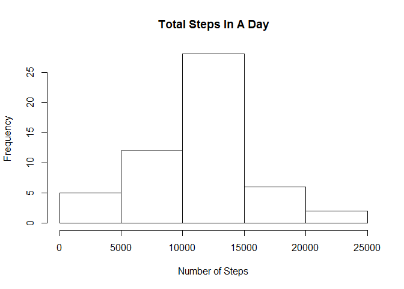
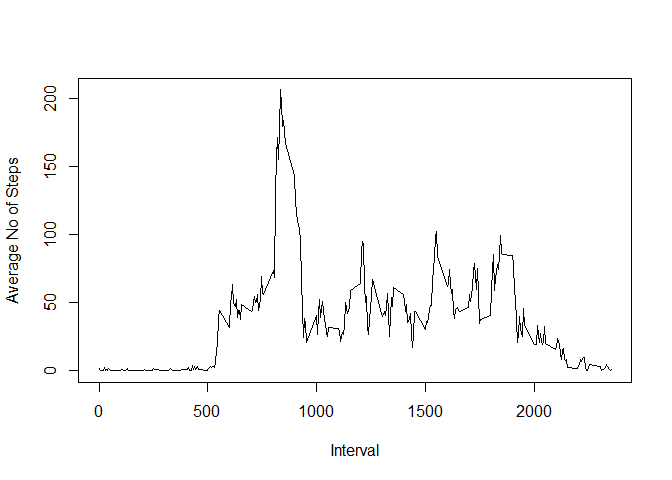
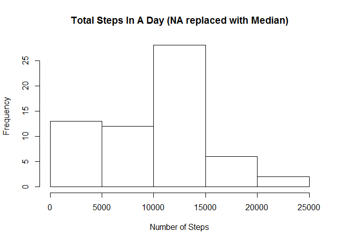
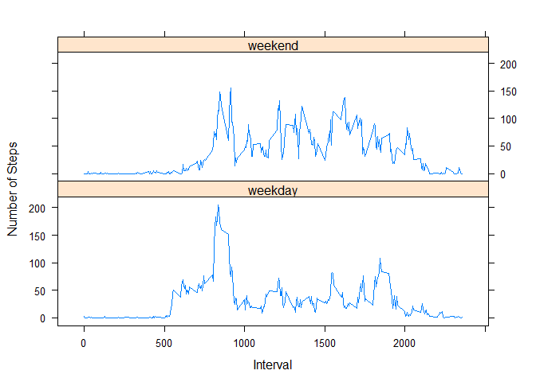

# Reproducible Research: Peer Assessment 1


###Loading and preprocessing the data

```r
dataset <- read.csv(unz('activity.zip', 'activity.csv'))

#see some data
head(dataset)
```

```
##   steps       date interval
## 1    NA 2012-10-01        0
## 2    NA 2012-10-01        5
## 3    NA 2012-10-01       10
## 4    NA 2012-10-01       15
## 5    NA 2012-10-01       20
## 6    NA 2012-10-01       25
```


###What is mean total number of steps taken per day?

#####1. Make a histogram of the total number of steps taken each day


```r
with(na.omit(dataset), hist(rowsum(steps, date), main='Total Steps In A Day', xlab='Number of Steps'))
```

 


#####2. Calculate and report the mean and median total number of steps taken per day


```r
# calculate mean 
steps_mean <- with(na.omit(dataset), mean(rowsum(steps, date)))
steps_mean
```

```
## [1] 10766.19
```

```r
# calculate median
steps_median <- with(na.omit(dataset), median(rowsum(steps, date)))
steps_median
```

```
## [1] 10765
```

**mean** = 10766.19  
**median** = 10765


###What is the average daily activity pattern?


#####1. Make a time series plot (i.e. type = "l") of the 5-minute interval (x-axis) and the average number of steps taken, averaged across all days (y-axis)


```r
values <- with(na.omit(dataset), aggregate(steps, list(interval), mean))
names(values) <- c('interval', 'mean_steps')
head(values)
```

```
##   interval mean_steps
## 1        0  1.7169811
## 2        5  0.3396226
## 3       10  0.1320755
## 4       15  0.1509434
## 5       20  0.0754717
## 6       25  2.0943396
```

```r
with(values, plot(mean_steps ~ interval, type='l', xlab='Interval', ylab='Average No of Steps'))
```

 


#####2. Which 5-minute interval, on average across all the days in the dataset, contains the maximum number of steps?


```r
values[which.max(values[,2]),]
```

```
##     interval mean_steps
## 104      835   206.1698
```

###Imputing missing values

#####1. Calculate and report the total number of missing values in the dataset (i.e. the total number of rows with NAs)

```r
nrow(dataset[is.na(dataset$steps),])
```

```
## [1] 2304
```

#####2. Devise a strategy for filling in all of the missing values in the dataset. The strategy does not need to be sophisticated. For example, you could use the mean/median for that day, or the mean for that 5-minute interval, etc.


Fill up with the missing values with **median** in that interval.


#####3. Create a new dataset that is equal to the original dataset but with the missing data filled in.


```r
# create new dataset by filling up missing data with median
new_dataset <- dataset
new_dataset$steps[is.na(new_dataset$steps)] <- with(new_dataset, ave(steps, interval, 
   FUN = function(x) median(x, na.rm = TRUE)))[is.na(new_dataset$steps)]

# see the result
head(new_dataset)
```

```
##   steps       date interval
## 1     0 2012-10-01        0
## 2     0 2012-10-01        5
## 3     0 2012-10-01       10
## 4     0 2012-10-01       15
## 5     0 2012-10-01       20
## 6     0 2012-10-01       25
```


#####4.Make a histogram of the total number of steps taken each day and Calculate and report the mean and median total number of steps taken per day. Do these values differ from the estimates from the first part of the assignment? What is the impact of imputing missing data on the estimates of the total daily number of steps?


```r
with(new_dataset, hist(rowsum(steps, date), main='Total Steps In A Day (NA replaced with Median)', xlab='Number of Steps'))
```

 

```r
# calculate mean
new_steps_mean <- with(na.omit(new_dataset), mean(rowsum(steps, date)))
new_steps_mean
```

```
## [1] 9503.869
```

```r
# calculate median
new_steps_median <- with(na.omit(new_dataset), median(rowsum(steps, date)))
new_steps_median
```

```
## [1] 10395
```

**mean** = 9503.87  
**median** = 10395

Yes, the values are differ from the first part of assignment.  
By inputting missing value with Median, it increase the frequency for each block of data.  


###Are there differences in activity patterns between weekdays and weekends?


#####1. Create a new factor variable in the dataset with two levels - "weekday" and "weekend" indicating whether a given date is a weekday or weekend day.


```r
new_dataset$day <- as.factor(ifelse(weekdays(as.Date(new_dataset$date)) %in% c('Saturday', 'Sunday'),'weekend','weekday'))

#view the result
head(new_dataset)
```

```
##   steps       date interval     day
## 1     0 2012-10-01        0 weekday
## 2     0 2012-10-01        5 weekday
## 3     0 2012-10-01       10 weekday
## 4     0 2012-10-01       15 weekday
## 5     0 2012-10-01       20 weekday
## 6     0 2012-10-01       25 weekday
```


#####2. Make a panel plot containing a time series plot (i.e. type = "l") of the 5-minute interval (x-axis) and the average number of steps taken, averaged across all weekday days or weekend days (y-axis). See the README file in the GitHub repository to see an example of what this plot should look like using simulated data.


```r
library(lattice)
day_mean <- with(new_dataset, aggregate(steps, list(interval, day), mean))
names(day_mean) <- c('interval', 'day', 'meansteps')
xyplot(meansteps ~ interval | day, data=day_mean , type='l', layout=c(1,2), xlab='Interval', ylab='Number of Steps')
```

 

